# 📓 Jupyter Notebooks – CKAN Dataset Handling (Reallocate Pilot 2)

This folder contains the Jupyter notebooks used for interacting with the CKAN API as part of the Reallocate Pilot 2. These notebooks assist in reading, preparing, and uploading datasets to the CKAN instance used to support the matchmaking tool designed by CERTH.

This interface ensures data interoperability between the Barcelona pilot and the broader Reallocate project infrastructure.

---

## 🧭 Notebook Execution Flow

The diagram below will illustrate the structure and dependencies between the notebooks. This helps users understand how data flows from preparation to upload.

```mermaid
graph TD
  A1["🔽 Load data from Municipal CKAN"]
  A2["🧹 Clean dataset"]
  A3["💾 Save dataset (locally or temp storage)"]
  A4["📦 Create/Update dataset in our CKAN"]
  A5["📤 Upload/Update resources to CKAN dataset"]

  A1 --> A2 --> A3 --> A4 --> A5
```

<!-- Replace this comment with a Mermaid diagram when ready -->

## 🔢 Notebook Index

| Notebook | Purpose |
|----------|---------|
| `BcnOpenAPI.ipynb` | Explore and test the connection with the Barcelona Open Data API (used as an example for data acquisition). |
| `Read-Dataset-CKAN.ipynb` | Load datasets directly from the CKAN portal using its REST API and validate their structure. |
| `Upload-Dataset-CKAN.ipynb` | Create new datasets and upload resources (e.g., CSV files) to the CKAN instance via API. |

---

## 🧩 Context & Usage

The aim of this notebook collection is to support the **matchmaking dashboard** built by CERTH by ensuring that the necessary datasets are available and properly formatted in CKAN.

To enable integration:
- Datasets must follow the naming and schema conventions agreed upon in the Reallocate consortium.
- Resources should be well-documented and regularly updated to maintain synchronization with the data needs of the matchmaking interface.
